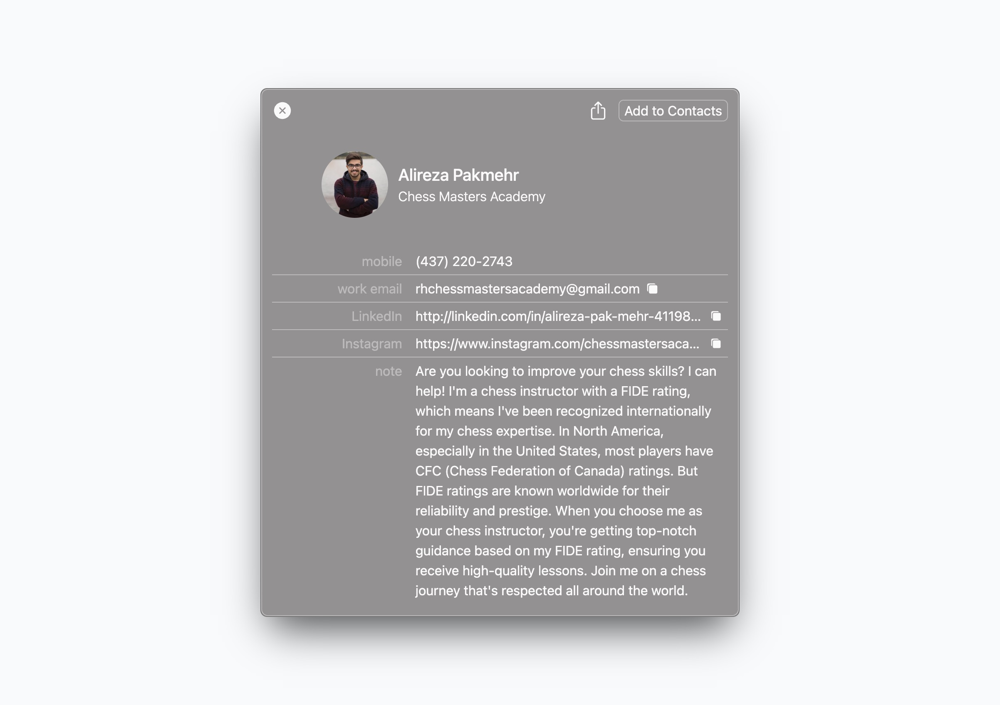
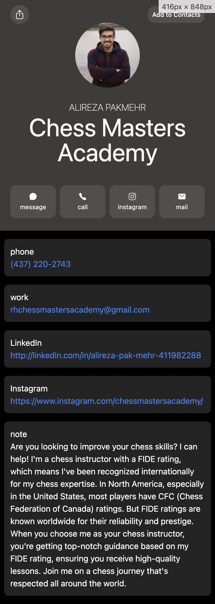

# Chess Masters Academy - Contact Information Card

This project involves the creation of a digital contact card for Alireza Pakmehr, a chess instructor associated with the Chess Masters Academy. The contact card is designed to be viewed on both desktop and mobile devices, ensuring accessibility and ease of use for potential clients.

## Project Overview

The main objective of this project was to design a contact information card that showcases Alireza Pakmehr's credentials, contact information, and social media links in a visually appealing and user-friendly manner. The card includes essential details such as mobile number, work email, LinkedIn, Instagram, and a brief note highlighting Alireza's expertise and the benefits of choosing him as a chess instructor.

## Features

- **Responsive Design**: The contact card is optimized for both desktop and mobile views, ensuring a seamless user experience across different devices.
- **Comprehensive Contact Information**: Includes mobile number, email address, LinkedIn profile, and Instagram handle.
- **Professional Note**: A brief note that emphasizes Alireza Pakmehr's FIDE rating and his expertise in chess tutoring.
- **Easy Access Links**: Direct links to contact via phone, email, LinkedIn, and Instagram.

## Screenshots

### Desktop View

### Mobile View

## Usage

To use this contact information card:

1. Open the webpage [www.arshia-naseri.github.io/chess-masters-academy-2.0/](https://arshia-naseri.github.io/chess-masters-academy-2.0/) (desktop or mobile).
2. Click on the respective links to contact Alireza via phone, email, LinkedIn, or Instagram.

## Contact

For any queries or further information, please contact Alireza Pakmehr at:

- **Mobile**: (437) 220-2743
- **Email**: rhchessmastersacademy@gmail.com
- **LinkedIn**: [Alireza Pakmehr](http://linkedin.com/in/alireza-pak-mehr-411982288)
- **Instagram**: [Chess Masters Academy](https://www.instagram.com/chessmastersacademy/)
